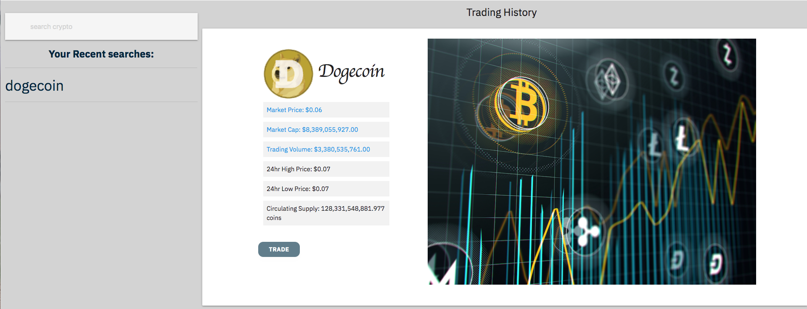

# Cryptelligent

Welcome to Cryptelligent! This app that allows you to search the trending
cryptocurrencies and monitor specific coins, as well as read related stories on crypto.

## Description

The purpose of this project was to create an online application for new investors who wish to learn more about the world of cryptocurrency. Upon visiting the application, users will be greeted with a short slider introducing the use and purpose, so they know how to use it.

Firstly, Users can use short lessons on the sidebar to learn about pertinent topics that they should be aware of before investing. A few examples:

- History of Crypto
- Key Terminology
- Tax Implications
- Popular Coins

Once the user becomes familiar with the foundation of cryptocurrency, they can proceed to read and review the latest market trends and news. This is provided by pulling cryptocurrency related news (only) from Bloomberg News source. This will update automatically, so the user will always know how the market is doing on that day.

From this point on, we hope that the user is familiar enough with the crypto world to get started on viewing coin performance. The user can search any coin, buy its full name (such as "Bitcoin") or symbol (such as "BTC"). This search will grab live data from CoinGecko, and return the market price and cap, trading volume, high and low prices in the last 24 hours, as well as maxiumum and circulating supply. All searches will be saved, so the user can reference their previous search history during that session.

## How it was built

This planner includes HTML, CSS, Materialize, JavaScript, and jQuery. AJAX was also used to grab data from CoinGecko and Bloomberg APIs as JSON, which was then translated over to display properly on the page for the user.

## How to start application

Right click on index.html file and select open with live server in Visual Studio Code.

The following API's were used:

- [CoinGecko](https://www.coingecko.com/api/documentations/v3)
- [Bloomberg News](https://www.bloomberg.com/professional/support/api-library/)

[Click here to get started!](https://eroux13.github.io/Cryptelligent/)

# Screenshots

New User Welcome Screen
Live Data Screenshot
Cryptocurreny information
